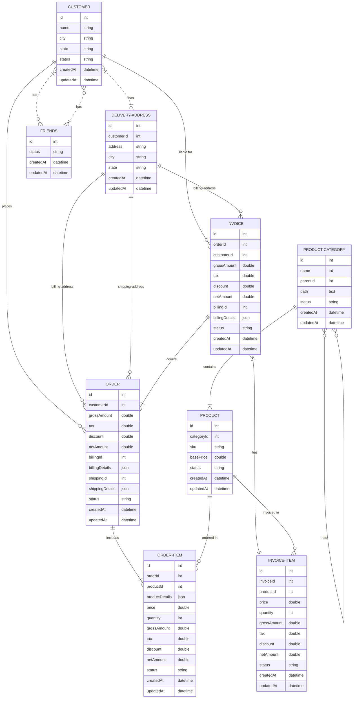

# Welcome to SequelizeByExample

This is a community initiative to make alternative way to document things by example. To have examples, this document follows a sample data structure. The structure is designed to cover as much examples out of it, as a developer may need from sequelize project.

Also this document provides best practises with Sequelize.

## Start with MySQL and V5 only

We works mostly in MySQL and our current version is V5, but we are structuring the document as such, that, others can contribute for other versions or other dialects also.

## Main Focus
Main focus will always be on Reading like Reporting, Grouping, Nested Data with Conditions etc. 
Also we will try to simplyfy some of technical things under the hood.

## Sample Database

Following will be sample database structure used for our examples, we will try our level best to cover as much real life cases as we can.

If you have any case or want to add some other way of solution or change the database structure, you are welcome to contribute. Please check CONTRIBUTION section for more.


# Relations in simple text

```
Customer blongsToMany Customers through Frends
Customer hasMany Deliver Addresses
Customer hasMany Orders
Customer hasMany Invoices

DeliverAddresses belongsTo Customer
DeliverAddresses hasMany Orders as OrderBillingAddresses
DeliverAddresses hasMany Orders as OrderShippingAddresses
DeliverAddresses hasMany Invoices as InvoiceBillingAddresses

Order belongsTo Customer
Order hasMany OrderItem
Order hasOne Invoice
OrderItem belongsTo Product

Invoice belongsTo Customer
Invoice hasMany InvoiceItem
Invoice belongsTo DeliveryAddresses

InvoiceItem belongsTo Invoice
InvoiceItem belongsTo Product

Product hasMany OrderItems
Product hasMany InvoiceItems
Product belongsTo Category

Category hasMany Products
Category belongsTo Category as ParentCategory
Category hasMany Category as ChildrenCategories

```

Use the following code on mermaid to generate the above diagram

```json
erDiagram
          CUSTOMER }|..|{ DELIVERY-ADDRESS : has
          CUSTOMER }|..o{ FRIENDS : has
          FRIENDS }|..o{ CUSTOMER : has
          CUSTOMER ||--o{ ORDER : places
          CUSTOMER ||--o{ INVOICE : "liable for"
          DELIVERY-ADDRESS ||--o{ ORDER : receives
          INVOICE ||--|{ ORDER : covers
          INVOICE }|--|| INVOICE-ITEM : has
          ORDER ||--|{ ORDER-ITEM : includes
          PRODUCT-CATEGORY ||--|{ PRODUCT : contains
          PRODUCT-CATEGORY }o--o{ PRODUCT-CATEGORY : has
          PRODUCT ||--o{ ORDER-ITEM : "ordered in"
          PRODUCT ||--o{ INVOICE-ITEM : "invoiced in"
          
          CUSTOMER {
            id int
            name string
            city string
            state string
            status string
            createdAt datetime
            updatedAt datetime
          }

          FRIENDS{
            id int
            status string
            createdAt datetime
            updatedAt datetime
          }

          DELIVERY-ADDRESS{
            id int
            customerId int
            address string
            city string
            state string
            createdAt datetime
            updatedAt datetime
          }

          INVOICE{
            id int
            orderId int
            grossAmount double
            tax double
            discount double
            netAmount double
            billingId int
            billingDetails json
            status string
            createdAt datetime
            updatedAt datetime
          }

          INVOICE-ITEM{
            id int
            invoiceId int
            productId int
            price double
            quantity int
            grossAmount double
            tax double
            discount double
            netAmount double
            status string
            createdAt datetime
            updatedAt datetime
          }

          ORDER {
            id int
            grossAmount double
            tax double
            discount double
            netAmount double
            billingId int
            billingDetails json
            shippingId int
            shippingDetails json
            status string
            createdAt datetime
            updatedAt datetime
          }

          ORDER-ITEM {
            id int
            orderId int
            productId int
            productDetails json
            price double
            quantity int
            grossAmount double
            tax double
            discount double
            netAmount double
            status string
            createdAt datetime
            updatedAt datetime
          }

          PRODUCT {
            id int
            categoryId int
            sku string
            basePrice double
            status string
            createdAt datetime
            updatedAt datetime
          }

          PRODUCT-CATEGORY {
            id int
            name int
            parentId int
            path text
            status string
            createdAt datetime
            updatedAt datetime
          }
```

[Mermaid Js Online Editor](https://mermaid-js.github.io/mermaid-live-editor/)

[Live Mermaid Link](https://mermaid-js.github.io/mermaid-live-editor/edit#eyJjb2RlIjoiZXJEaWFncmFtXG4gICAgICAgICAgQ1VTVE9NRVIgfXwuLnx7IERFTElWRVJZLUFERFJFU1MgOiBoYXNcbiAgICAgICAgICBDVVNUT01FUiB8fC0tb3sgT1JERVIgOiBwbGFjZXNcbiAgICAgICAgICBDVVNUT01FUiB8fC0tb3sgSU5WT0lDRSA6IFwibGlhYmxlIGZvclwiXG4gICAgICAgICAgREVMSVZFUlktQUREUkVTUyB8fC0tb3sgT1JERVIgOiByZWNlaXZlc1xuICAgICAgICAgIElOVk9JQ0UgfHwtLXx7IE9SREVSIDogY292ZXJzXG4gICAgICAgICAgSU5WT0lDRSB9fC0tfHwgSU5WT0lDRS1JVEVNIDogaGFzXG4gICAgICAgICAgT1JERVIgfHwtLXx7IE9SREVSLUlURU0gOiBpbmNsdWRlc1xuICAgICAgICAgIFBST0RVQ1QtQ0FURUdPUlkgfHwtLXx7IFBST0RVQ1QgOiBjb250YWluc1xuICAgICAgICAgIFBST0RVQ1QtQ0FURUdPUlkgfW8tLW97IFBST0RVQ1QtQ0FURUdPUlkgOiBoYXNcbiAgICAgICAgICBQUk9EVUNUIHx8LS1veyBPUkRFUi1JVEVNIDogXCJvcmRlcmVkIGluXCJcbiAgICAgICAgICBQUk9EVUNUIHx8LS1veyBJTlZPSUNFLUlURU0gOiBcImludm9pY2VkIGluXCJcbiAgICAgICAgICBcbiAgICAgICAgICBDVVNUT01FUiB7XG4gICAgICAgICAgICBpZCBpbnRcbiAgICAgICAgICAgIG5hbWUgc3RyaW5nXG4gICAgICAgICAgICBjaXR5IHN0cmluZ1xuICAgICAgICAgICAgc3RhdGUgc3RyaW5nXG4gICAgICAgICAgICBjcmVhdGVkQXQgZGF0ZXRpbWVcbiAgICAgICAgICAgIHVwZGF0ZWRBdCBkYXRldGltZVxuICAgICAgICAgIH1cblxuICAgICAgICAgIERFTElWRVJZLUFERFJFU1N7XG4gICAgICAgICAgICBpZCBpbnRcbiAgICAgICAgICAgIGN1c3RvbWVySWQgaW50XG4gICAgICAgICAgICBhZGRyZXNzIHN0cmluZ1xuICAgICAgICAgICAgY2l0eSBzdHJpbmdcbiAgICAgICAgICAgIHN0YXRlIHN0cmluZ1xuICAgICAgICAgICAgY3JlYXRlZEF0IGRhdGV0aW1lXG4gICAgICAgICAgICB1cGRhdGVkQXQgZGF0ZXRpbWVcbiAgICAgICAgICB9XG5cbiAgICAgICAgICBJTlZPSUNFe1xuICAgICAgICAgICAgaWQgaW50XG4gICAgICAgICAgICBvcmRlcklkIGludFxuICAgICAgICAgICAgZ3Jvc3NBbW91bnQgZG91YmxlXG4gICAgICAgICAgICB0YXggZG91YmxlXG4gICAgICAgICAgICBkaXNjb3VudCBkb3VibGVcbiAgICAgICAgICAgIG5ldEFtb3VudCBkb3VibGVcbiAgICAgICAgICAgIGJpbGxpbmdJZCBpbnRcbiAgICAgICAgICAgIGJpbGxpbmdEZXRhaWxzIGpzb25cbiAgICAgICAgICAgIGNyZWF0ZWRBdCBkYXRldGltZVxuICAgICAgICAgICAgdXBkYXRlZEF0IGRhdGV0aW1lXG4gICAgICAgICAgfVxuXG4gICAgICAgICAgSU5WT0lDRS1JVEVNe1xuICAgICAgICAgICAgaWQgaW50XG4gICAgICAgICAgICBpbnZvaWNlSWQgaW50XG4gICAgICAgICAgICBwcm9kdWN0SWQgaW50XG4gICAgICAgICAgICBwcmljZSBkb3VibGVcbiAgICAgICAgICAgIHF1YW50aXR5IGludFxuICAgICAgICAgICAgZ3Jvc3NBbW91bnQgZG91YmxlXG4gICAgICAgICAgICB0YXggZG91YmxlXG4gICAgICAgICAgICBkaXNjb3VudCBkb3VibGVcbiAgICAgICAgICAgIG5ldEFtb3VudCBkb3VibGVcbiAgICAgICAgICAgIGNyZWF0ZWRBdCBkYXRldGltZVxuICAgICAgICAgICAgdXBkYXRlZEF0IGRhdGV0aW1lXG4gICAgICAgICAgfVxuXG4gICAgICAgICAgT1JERVIge1xuICAgICAgICAgICAgaWQgaW50XG4gICAgICAgICAgICBncm9zc0Ftb3VudCBkb3VibGVcbiAgICAgICAgICAgIHRheCBkb3VibGVcbiAgICAgICAgICAgIGRpc2NvdW50IGRvdWJsZVxuICAgICAgICAgICAgbmV0QW1vdW50IGRvdWJsZVxuICAgICAgICAgICAgYmlsbGluZ0lkIGludFxuICAgICAgICAgICAgYmlsbGluZ0RldGFpbHMganNvblxuICAgICAgICAgICAgc2hpcHBpbmdJZCBpbnRcbiAgICAgICAgICAgIHNoaXBwaW5nRGV0YWlscyBqc29uXG4gICAgICAgICAgICBjcmVhdGVkQXQgZGF0ZXRpbWVcbiAgICAgICAgICAgIHVwZGF0ZWRBdCBkYXRldGltZVxuICAgICAgICAgIH1cblxuICAgICAgICAgIE9SREVSLUlURU0ge1xuICAgICAgICAgICAgaWQgaW50XG4gICAgICAgICAgICBvcmRlcklkIGludFxuICAgICAgICAgICAgcHJvZHVjdElkIGludFxuICAgICAgICAgICAgcHJvZHVjdERldGFpbHMganNvblxuICAgICAgICAgICAgcHJpY2UgZG91YmxlXG4gICAgICAgICAgICBxdWFudGl0eSBpbnRcbiAgICAgICAgICAgIGdyb3NzQW1vdW50IGRvdWJsZVxuICAgICAgICAgICAgdGF4IGRvdWJsZVxuICAgICAgICAgICAgZGlzY291bnQgZG91YmxlXG4gICAgICAgICAgICBuZXRBbW91bnQgZG91YmxlXG4gICAgICAgICAgICBjcmVhdGVkQXQgZGF0ZXRpbWVcbiAgICAgICAgICAgIHVwZGF0ZWRBdCBkYXRldGltZVxuICAgICAgICAgIH1cblxuICAgICAgICAgIFBST0RVQ1Qge1xuICAgICAgICAgICAgaWQgaW50XG4gICAgICAgICAgICBjYXRlZ29yeUlkIGludFxuICAgICAgICAgICAgc2t1IHN0cmluZ1xuICAgICAgICAgICAgYmFzZVByaWNlIGRvdWJsZVxuICAgICAgICAgICAgY3JlYXRlZEF0IGRhdGV0aW1lXG4gICAgICAgICAgICB1cGRhdGVkQXQgZGF0ZXRpbWVcbiAgICAgICAgICB9XG5cbiAgICAgICAgICBQUk9EVUNULUNBVEVHT1JZIHtcbiAgICAgICAgICAgIGlkIGludFxuICAgICAgICAgICAgbmFtZSBpbnRcbiAgICAgICAgICAgIHBhcmVudElkIGludFxuICAgICAgICAgICAgcGF0aCB0ZXh0XG4gICAgICAgICAgICBjcmVhdGVkQXQgZGF0ZXRpbWVcbiAgICAgICAgICAgIHVwZGF0ZWRBdCBkYXRldGltZVxuICAgICAgICAgIH1cbiAgICAgICAgICAgICIsIm1lcm1haWQiOiJ7fSIsInVwZGF0ZUVkaXRvciI6ZmFsc2UsImF1dG9TeW5jIjpmYWxzZSwidXBkYXRlRGlhZ3JhbSI6ZmFsc2V9)